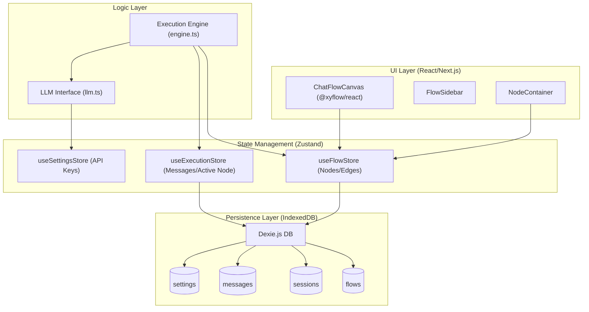
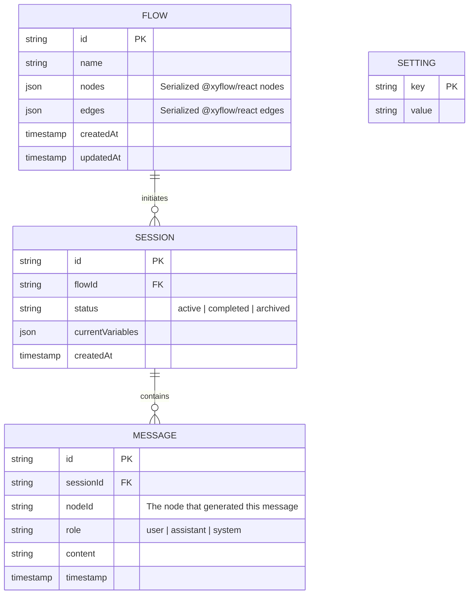

# FlowChat

FlowChat is a "Bring Your Own Key" (BYOK) AI chat application featuring a node-based flow interface. It allows users to visually design and execute complex chat flows while maintaining complete control over their API keys and data.

## 🚀 Features

- **Node-Based Interface**: Design chat logic visually using a drag-and-drop canvas powered by [@xyflow/react](https://github.com/xyflow/xyflow).
- **Bring Your Own Key (BYOK)**: Securely manage your own AI provider API keys locally.
- **Local-First Architecture**: Your flows, sessions, and messages are stored safely in your browser using IndexedDB (via [Dexie.js](https://dexie.org/)).
- **Branching Conversations**: Create complex conversation paths with conditional logic and multiple outcomes.
- **Recursive Execution Engine**: A robust backend logic that traverses your flow designs to provide a seamless chat experience.

---

## 🏗 Architecture

FlowChat follows a modular, local-first architecture to ensure speed, privacy, and extensibility.



---

## 📊 Data Model (ERD)

The application uses a relational-style schema on top of IndexedDB to manage complex flow templates and their respective runtime sessions.



---

## 🛠 Tech Stack

- **Framework**: [Next.js 15+](https://nextjs.org/)
- **UI & Interaction**: [Tailwind CSS](https://tailwindcss.com/), [Shadcn UI](https://ui.shadcn.com/), [@xyflow/react](https://reactflow.dev/)
- **State Management**: [Zustand](https://github.com/pmndrs/zustand)
- **Database**: [Dexie.js](https://dexie.org/) (IndexedDB wrapper)
- **Icons**: [Lucide React](https://lucide.dev/)

---

## 🏁 Getting Started

### Prerequisites

- Node.js (v18 or higher)
- npm or yarn

### Installation

1. Clone the repository:
   ```bash
   git clone <repository-url>
   cd flowchat
   ```

2. Install dependencies:
   ```bash
   npm install
   ```

3. Run the development server:
   ```bash
   npm run dev
   ```

4. Open [http://localhost:3000](http://localhost:3000) in your browser.

---

## 📜 License

[MIT](LICENSE)
